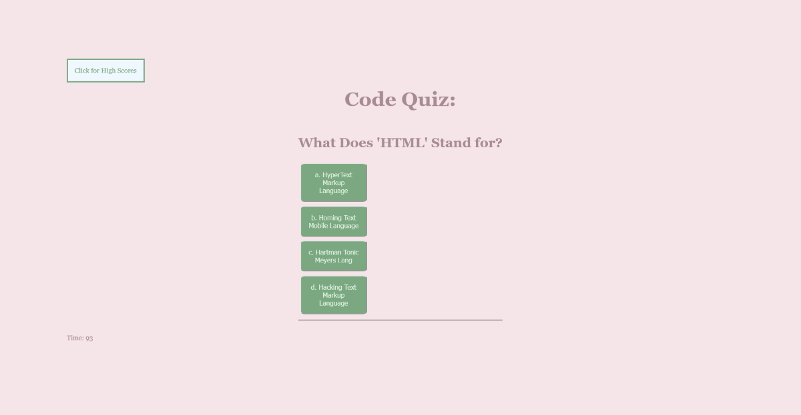

# Code-Quiz-JS
Code Quiz in browser made with JS

[Link to Site](https://masonmarc.github.io/Code-Quiz-JS/)

[Link to Github Repo](https://github.com/MasonMarc/Code-Quiz-JS)

# Table of Contents

[Descriptions](#descriptions)

[Visuals](#visuals)

[Resources](#resources)

# Descriptions

This project is a Code Quiz the user can take using JavaScript. It records your score and it is timed. Getting an answer wrong will result in a decrease in time remaining and your score will be submitted at the end for the high score. 

# Visuals

# Resoruces

[General](https://www.w3schools.com)

[JS Objects](https://developer.mozilla.org/en-US/docs/Learn/JavaScript/Objects/Basics)